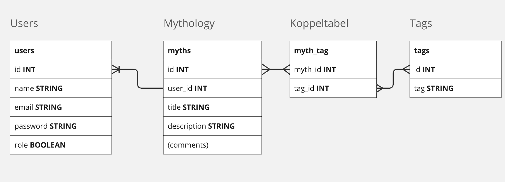

# Changelog Laravel Project
## 9-10-2024
* Nieuw Laravel project aangemaakt
* Breeze geïnstalleerd

## 14-10-2024
### User stories
### Als gast
* wil ik alle posts kunnen zien (S)
* wil ik kunnen registreren (M)

### Als gebruiker
* wil ik kunnen inloggen (M)
* wil ik toegang hebben tot een profiel (S)
* wil ik mijn eigen posts kunnen zien (M)
* wil ik een post kunnen aanmaken (M)
* wil ik een post kunnen aanpassen (S)
* wil ik een post kunnen verwijderen (C)

### Als admin
* wil ik kunnen inloggen (M)
* wil ik toegang hebben tot een admin dashboard (M)
* wil ik de posts kunnen af- of goedkeuren (M)
* wil ik een post kunnen verwijderen (S)

### ERD

## 15-10-2024
* nieuwe routes voor (de meeste) pagina's
* database toegevoegd (migrate)

## 17-10-2024
* one-to-many relatie aangemaakt tussen users en posts
* geswitched van myths (ERD) naar gods om makkelijker data in te kunnen vullen

## 22-10-2024
* edit functie gemaakt
* update functie werkend gemaakt
* user middelware toegepast
* formulier validatie

## 23-10-2024
* many-to-many geïmplementeerd met tags
* crud tags toegevoegd
* meerdere tags select toegevoegd in create

## 28-10-2024
* post edit user_id fix (kon ook editen vanaf een ander account)
* admin role toegevoegd met admin dashboard
* admin middleware aangemaakt tegen deeplinken
* toggle functie op dashboard voor posts (verbergt de post ook in de overview)

